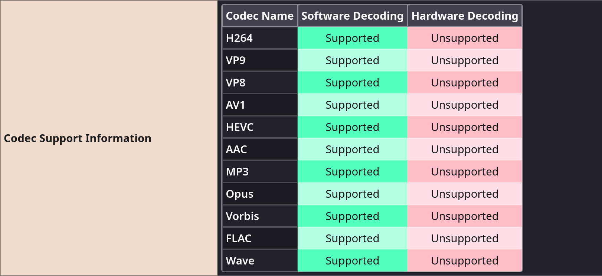
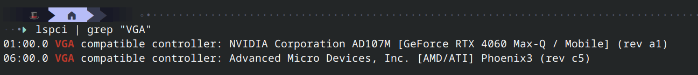
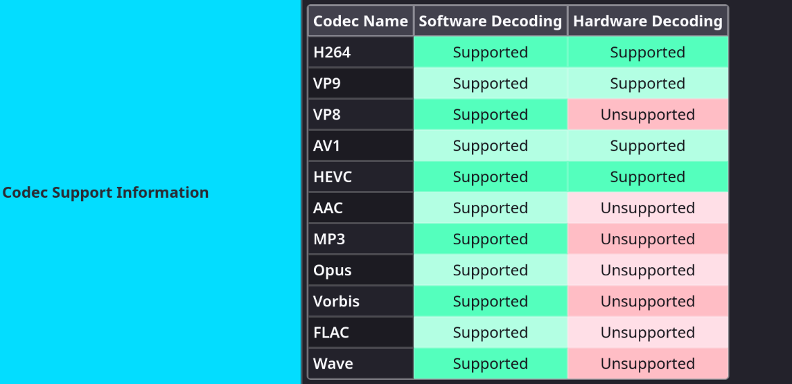
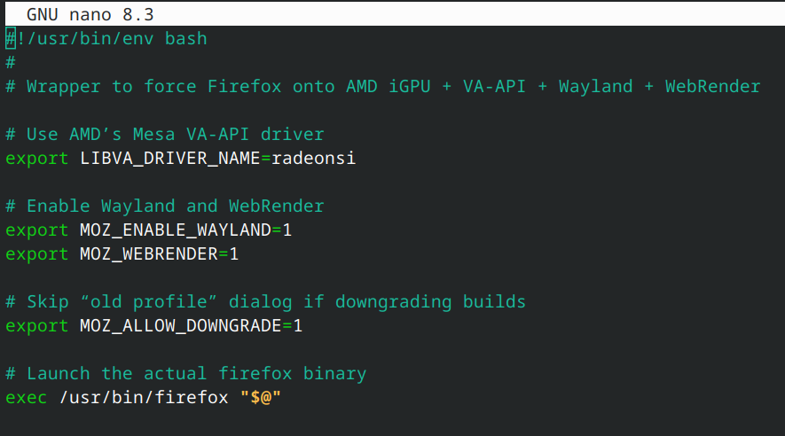
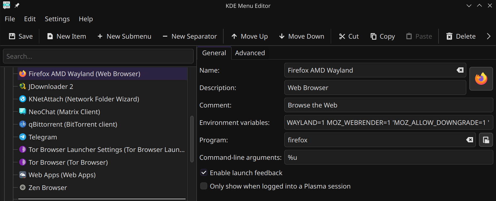

# Firefox Hardware Decoding on Hybrid NVIDIA/AMD Linux Systems

This document summarizes the steps needed to enable GPU‑accelerated video decoding (VA‑API) and WebRender in Firefox when running a hybrid NVIDIA + AMD setup on a Linux distribution (e.g. Nobara, Fedora, Ubuntu, etc.). It covers:

1. Diagnosing the “All hardware decoding not supported” message in Firefox  
2. Identifying GPU hardware and installed VA‑API drivers  
3. Forcing Firefox to use the AMD iGPU (Mesa/VA‑API) instead of NVIDIA’s unsupported VA‑API plugin  
4. Creating a small “wrapper” script that sets the proper environment variables every time Firefox launches  
5. (Optional) Editing the KDE desktop entry so that clicking “Firefox” in the menu automatically applies these settings  

Use this README as a reference when you face poor video performance or high CPU usage while playing fullscreen/4K video in Firefox on a laptop with dual GPUs.

---

## Table of Contents

1. [Background & Symptoms](#background--symptoms)  
2. [Step 1: Basic Firefox Check](#step-1-basic-firefox-check)  
3. [Step 2: Identify Installed GPUs](#step-2-identify-installed-gpus)  
4. [Step 3: Inspect VA‑API Drivers (`vainfo`)](#step-3-inspect-va-api-drivers-vainfo)  
5. [Step 4: Configure AMD/VA‑API Instead of NVIDIA](#step-4-configure-amdva-api-instead-of-nvidia)  
6. [Step 5: Test VA‑API with `vainfo`](#step-5-test-va-api-with-vainfo)  
7. [Step 6: Launch Firefox with the Right Environment Variables](#step-6-launch-firefox-with-the-right-environment-variables)  
8. [Step 7: Create a “Wrapper” Script](#step-7-create-a-wrapper-script)  
9. [Step 8 (Optional): Update KDE `.desktop` Entry](#step-8-optional-update-kde-desktop-entry)  
10. [Tested Hardware & Environment](#tested-hardware--environment)  
11. [Troubleshooting Tips](#troubleshooting-tips)  
12. [Further Reading](#further-reading)  

---

## Background & Symptoms

If Firefox’s `about:support` page shows:


> ⚠️ Firefox shows **Hardware Video Decoding: unavailable** and **WebRender: disabled**

or if playing a high‑resolution video (e.g. YouTube 1080p/4K) consumes 100% CPU, then Firefox is not using your GPU to decode. On hybrid NVIDIA/AMD laptops, you often need to force Firefox to use the AMD iGPU’s Mesa/VA‑API driver (rather than attempting the broken NVIDIA VA‑API plugin).

Typical red flags:

- `about:support` displays “hardware decoding: false” or “VA‑API: blocked”  
- `vainfo` shows an error loading `nvidia_drv_video.so`  
- Firefox’s **WebRender compositor** or **video decoding** lines say “blocklisted”  

---

## Step 1: Basic Firefox Check

1. Open a terminal (X11 or Wayland, depending on your DE).  
2. Go to Firefox’s “Troubleshooting Information” page:
   ```bash
   firefox "about:support"
   ```
3. Under the **Graphics** section, check lines like:
   - `WebRender: <status>`  
   - `Hardware Video Decoding: <yes/no>`  
   - `VA‑API: <active/blocked>`  

If it reads “blocked” or “no,” proceed to identify why.


---

## Step 2: Identify Installed GPUs

Run:

```bash
lspci | grep -i vga
```

Typical output on a dual‑GPU laptop:


> 🖥️ Detected both NVIDIA (discrete) and AMD (integrated) GPUs.


- The **NVIDIA** device is often *not* VA‑API‑friendly on Linux (unless you compile and install a special `nvidia‑vaapi‑driver`).
- The **AMD Phoenix3** (integrated GPU) usually works out‑of‑the‑box via Mesa’s VA‑API.


---

## Step 3: Inspect VA‑API Drivers (`vainfo`)

Install the Mesa VA‑API utilities (if not already present):

```bash
# On Fedora/RHEL‑based (Nobara, Fedora, CentOS, etc.):
sudo dnf install libva libva-utils mesa‑va‑drivers ffmpeg gstreamer1‑vaapi

# On Debian/Ubuntu‑based:
sudo apt update
sudo apt install vainfo libva‑drivers mesa‑va‑drivers ffmpeg gstreamer1.0‑vaapi
```

Then run:

```bash
vainfo
```

### Common “Bad” Output (trying NVIDIA):


> ❌ `vainfo` tries to use `nvidia_drv_video.so` but fails to initialize VA‑API.

This means **VA‑API is trying to load `nvidia_drv_video.so`**, but it fails. Firefox will then claim “hardware decoding not supported.”

---

## Step 4: Configure AMD/VA‑API Instead of NVIDIA

To force VA‑API to use the AMD (Mesa) VA driver (called `radeonsi`), you need to:

1. **Unset or override** any existing `LIBVA_DRIVER_NAME` that points to NVIDIA.  
2. **Export `LIBVA_DRIVER_NAME=radeonsi`** so that Mesa’s driver is used.

In your shell (or wrapper script later), set:

```bash
export LIBVA_DRIVER_NAME=radeonsi
```

If you had previously run:

```bash
export LIBVA_DRIVER_NAME=nvidia
```

then doing the above ensures that next time you run `vainfo` (or Firefox), it attempts to open the AMD VA‑API driver, not NVIDIA’s.

---

## Step 5: Test VA‑API with `vainfo`

After setting:

```bash
export LIBVA_DRIVER_NAME=radeonsi
```

Then re‑run:

```bash
vainfo
```

Good output should look roughly like:


> ✅ VA‑API successfully initialized using AMD's `radeonsi` Mesa driver.


- **If you see Mesa/“radeonsi” driver** after “Trying to open…”, VA‑API is now functional on the AMD iGPU.
- **If it still fails**, double‑check that you have `mesa‑va‑drivers` installed and that no stale NVIDIA VA‑API libraries remain in `/usr/lib64/dri/`.

---

## Step 6: Launch Firefox with the Right Environment Variables

Now that VA‑API works on the AMD iGPU, you must launch Firefox so that:

1. **Firefox runs on Wayland** (to get WebRender).  
2. **Firefox uses the AMD iGPU’s VA‑API driver**.  
3. **(Optional) Skip the “profile downgrade” warning** if you switch versions frequently.


> ✅ Firefox shows **Hardware Video Decoding: active** and **WebRender: force_enabled**

The minimal command becomes:

```bash
LIBVA_DRIVER_NAME=radeonsi MOZ_ENABLE_WAYLAND=1 MOZ_WEBRENDER=1 MOZ_ALLOW_DOWNGRADE=1 firefox
```

- `LIBVA_DRIVER_NAME=radeonsi` → forces Mesa/AMD VA‑API.  
- `MOZ_ENABLE_WAYLAND=1` → tells Firefox to use the Wayland backend.  
- `MOZ_WEBRENDER=1` → forces WebRender GPU acceleration.  
- `MOZ_ALLOW_DOWNGRADE=1` → optional; prevents “Your profile is newer than this build” errors if you switch Firefox versions (e.g. nightlies vs release).

If you get a warning like:

```
Inconsistent value (1) for DRI_PRIME. Should be < 1 (GPU devices count). Using: 0
```

that simply means your system only sees one Mesa/DRI device, and it automatically falls back to GPU 0 (the AMD iGPU). You can safely drop `DRI_PRIME=1` in that case.

---

## Step 7: Create a “Wrapper” Script

Rather than remembering that long command every time, create a small script in `~/bin` (or anywhere in your `$PATH`) so that simply running `firefox-amd` does the job.

1. **Create `~/bin/firefox-amd`:**

   ```bash
   mkdir -p ~/bin
   nano ~/bin/firefox-amd
   ```

2. **Paste the following into `firefox-amd`:**

   ```bash
   #!/usr/bin/env bash
   #
   # Wrapper to force Firefox onto AMD iGPU + VA-API + Wayland + WebRender

   # Use AMD’s Mesa VA-API driver
   export LIBVA_DRIVER_NAME=radeonsi

   # Enable Wayland and WebRender
   export MOZ_ENABLE_WAYLAND=1
   export MOZ_WEBRENDER=1

   # Skip “old profile” dialog if downgrading builds
   export MOZ_ALLOW_DOWNGRADE=1

   # Launch the actual firefox binary
   exec /usr/bin/firefox "$@"
   ```

   
  > 📝 Wrapper script ensures Firefox always uses AMD VA‑API, Wayland, and WebRender.

   
   > Adjust `/usr/bin/firefox` if your system’s binary path differs (e.g. `/opt/firefox/firefox`).

3. **Make it executable:**

   ```bash
   chmod +x ~/bin/firefox-amd
   ```

4. **Ensure `~/bin` is in your `$PATH`:**

   Add to `~/.bashrc` or `~/.zshrc` (if not already present):

   ```bash
   export PATH="$HOME/bin:$PATH"
   ```

   Then run:

   ```bash
   source ~/.bashrc  # or `source ~/.zshrc`
   ```

5. **Run Firefox with:**

   ```bash
   firefox-amd
   ```

   Now Firefox will launch with all your environment variables pre‑set. Check `about:support` to verify `Hardware Video Decoding: active` and `WebRender: force_enabled`.

---

## Step 8 (Optional): Update KDE `.desktop` Entry

If you want **clicking “Firefox” in your KDE (Plasma) application menu** to always use these environment variables, you can edit the `.desktop` file:

1. **Locate your Firefox `.desktop` file.** It may be in one of:

   - `/usr/share/applications/firefox.desktop`  
   - `/var/lib/flatpak/exports/share/applications/org.mozilla.firefox.desktop`  
   - Or another path depending on your distro/Flatpak/Snap.

   If you cannot find it system‑wide, you can use:

   ```bash
   find /usr -name "firefox.desktop" 2>/dev/null | grep applications
   ```

2. **Copy it to your local user directory:**

   ```bash
   mkdir -p ~/.local/share/applications
   cp /path/to/original/firefox.desktop ~/.local/share/applications/firefox-amd-wayland.desktop
   ```

3. **Open the copied file in an editor:**

   ```bash
   nano ~/.local/share/applications/firefox-amd-wayland.desktop
   ```

4. **Modify the following lines** (under `[Desktop Entry]`):

   - **Name:**  
     ```ini
     Name=Firefox (AMD VA-API Wayland)
     ```
   - **Exec:** change from `firefox %u` to:
     ```ini
     Exec=env LIBVA_DRIVER_NAME=radeonsi MOZ_ENABLE_WAYLAND=1 MOZ_WEBRENDER=1 MOZ_ALLOW_DOWNGRADE=1 /usr/bin/firefox %u
     ```
     (Again, replace `/usr/bin/firefox` if your binary is elsewhere.)
   - **Comment/GenericName/Icon** can remain unchanged or be adjusted.
   

> 🖱️ KDE menu now launches Firefox with AMD VA‑API and Wayland enabled.
   
5. **Save and close.**

6. **Refresh the desktop database** (so KDE sees the new entry):

   ```bash
   update-desktop-database ~/.local/share/applications
   ```

7. **Launch “Firefox (AMD VA-API Wayland)”** from your application menu. It will automatically set the necessary environment variables.

---

## Tested Hardware & Environment

- **Operating System:** Nobara Linux 42
    
- **KDE Plasma Version:** 6.3.4
    
- **KDE Frameworks Version:** 6.13.0
    
- **Qt Version:** 6.9.0
    
- **Kernel Version:** 6.14.6‑200.nobara.fc42.x86_64 (64‑bit)
    
- **Graphics Platform:** Wayland
    
- **Processor:** 16 × AMD Ryzen 7 8845HS w/ Radeon 780M Graphics
    
- **Memory:** 30.6 GiB RAM
    
- **Graphics Processor:** AMD Radeon Graphics (Radeon 780M)
    
- **Manufacturer:** LENOVO
    
- **Product Name:** 83DX
    
- **System Version:** LOQ 15AHP9
    
- **VA‑API Version:** 1.22.0
    
- **Mesa (Driver) Version:** Mesa Gallium driver 25.1.0 for AMD Radeon Graphics (radeonsi, phoenix, LLVM 20.1.3, DRM 3.61, kernel 6.14.6-200.nobara.fc42.x86_64)
    
- **Firefox Version:** Mozilla Firefox 138.0

---

## Troubleshooting Tips

- **`vainfo` still failing after `export LIBVA_DRIVER_NAME=radeonsi`:**  
  - Make sure you installed `mesa-va-drivers` (or the equivalent package on your distro).  
  - Check for leftover NVIDIA VA‑API files in `/usr/lib*/dri/` and remove/rename them if you’re not intentionally using an NVIDIA VA driver.  
  - If using an APU + hybrid GPU, confirm your BIOS/firmware is set so that the iGPU is exposed (some laptops allow toggling “hybrid graphics” vs “discrete only”).

- **`about:support` still shows “Hardware Video Decoding: blocked”:**  
  - Double‑check `about:config`:
    - `media.ffmpeg.vaapi.enabled = true`  
    - `media.hardware-video-decoding.force-enabled = true`  
    - `gfx.webrender.all = true`  
  - In some cases, forcing `gfx.blocklist.all = false` will override driver blocklists—but be prepared for potential instability or crashes.

- **Firefox crashes or blanks-out when using Wayland:**  
  - Try launching without `MOZ_ENABLE_WAYLAND=1` (i.e. stick to X11), then test if hardware decoding still works.  
  - Ensure your user session is actually on Wayland (`echo $XDG_SESSION_TYPE`). If it says “x11,” Wayland flags may be ignored.

- **After an Ubuntu/Fedora upgrade, Firefox no longer loads VA‑API:**  
  - Check if your distribution’s Firefox packaging changed to Snap or Flatpak. These sandboxed packages sometimes break GPU access.  
  - If so, install the “classic” `.rpm`/`.deb` from Mozilla directly, or adjust Snap/Flatpak permissions to allow GPU access.

---

## Further Reading

- [Mozilla’s official guide on hardware acceleration](https://support.mozilla.org/en-US/kb/firefox-uses-gpu-acceleration)  
- [Mesa/VA‑API documentation](https://github.com/intel/libva/wiki/VA-API)  
- [NVIDIA VA‑API driver (unofficial)](https://github.com/elFarto/nvidia-vaapi-driver) (experimental; not covered here)  
- [Firefox environment variables (Wayland, WebRender)](https://wiki.mozilla.org/B2G/Playbook/Wayland)  

---

### Author

*Documented by [Your Name or GitHub Handle]*  
Based on troubleshooting steps for hybrid NVIDIA + AMD laptop on Linux (e.g. Nobara, Fedora, Ubuntu).  

Feel free to open issues or pull requests if you spot inaccuracies or want to suggest improvements!
